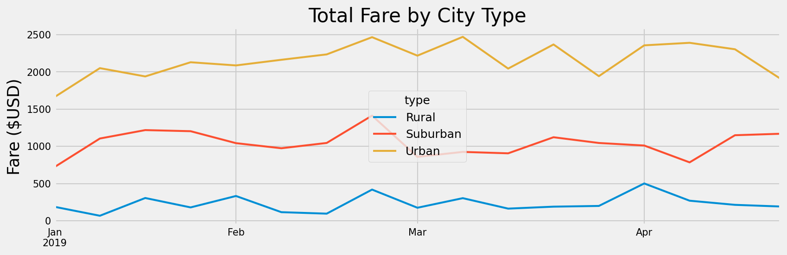

# Challenge - PyBer Analysis

## Challenge - Overview of Analysis

The purpose of the original analysis was to compare the different City Types, Rural, Suburban, and Urban, against each other in various categories, including: Total Number of Rides, Average Fares, and Numbers of Drivers. In this new analysis we wanted to create a summary DataFrame of the ride-sharing data by City Type, which meant considering: Total Rides, Total Drivers, Total Fares, Average Fare per Ride, and Average Fare per Driver.

We then wanted to create a graph that would clearly show us the Total Fare Each Week by City Type so we could compare the differences. From this graph we would make recommendations to the CEO on decisions moving forward with the company. We want to summarize how the data differs by each City Type and use the variations to propose ideas the company could employ to help future growth.

## Challenge - Results

We used the dataset available to us to compare the different City Types in several categories, then we created a Summary DataFrame to review our findings (see below):

|          | Total Rides   | Total Drivers   | Total Fares   | Average Fare per Ride   | Average Fare per Driver   |
|:---------|:--------------|:----------------|:--------------|:------------------------|:--------------------------|
| Rural    | 125           | 78              | ＄4,327.93    | ＄34.62                 | ＄55.49                   |
| Suburban | 625           | 490             | ＄19,356.33   | ＄30.97                 | ＄39.50                   |
| Urban    | 1,625         | 2,405           | ＄39,854.38   | ＄24.53                 | ＄16.57                   |

This DataFrame gave us a good look at the comparison between City Types, and from it we can see some large differences:

- Both the Total Rides and Total Drivers are much lower in the Rural cities when compared to Urban ones. In general, there are less people in Rural areas compared to Urban, so there is likely less demand for rides and less drivers available to fill the demand.
- Both the Average Fare per Ride and Average Fare per Driver is lower in Urban cities compared to Rural. This could be due to the distances between stops increasing the cost for each ride.
- The Suburban sits between the two other City Types as expected, as it contains elements from both: more people than Rural cities, and more spaced out than Urban ones.

We also used our summary DataFrame to create a multi-line graph based on the Total Fares for each City, separated into weeks:

To create this graph, we created a new DataFrame that took into account the City Types (like before), but also the dates of the rides. We then found the Total Fares for these days and combined them into weeks that we would create the plot with. This was done using `pivot` and resampling the DataFrame with `resample`. The initial look at the graph gives us a visualization of the conclusions we drew from the Summary DataFrame: that there is more total spending (Total Fares) in the Urban cities compared to Suburban cities and the even smaller Rural ones.

## Challenge - Summary

Based on our reviewing of both the Summary DataFrame and the Total Fare by City Type graph, we can make a number of recommendations moving forward with the company. Keeping in mind the decision-makers of the company are limited to only having control over changing the number of drivers employed, and the price of the fares in each city or type of city.

- The number of drivers to rides is vastly different in Rural and Urban communities, there seems to be a much higher demand for rides in Rural communities than in Urban ones. Looking forward it would make sense to **increase the number of Rural drivers** so that the supply can keep up with the demand. Even if the number of rides were not to increase the Total Fares wouldn't decrease, we would just see an Average Fare per Ride and Average Fare per Driver more in line with that of Urban cities.

- In the same vein as the previous suggestion, we could look at **decreasing the number of Urban drivers**, as there are more drivers in these cities than there have been rides. We would never really need more drivers than rides, so we could look at which Urban cities have low demand but a high driver count, and begin there with lowering this number.

- Again, the only direct control we have is over the number of drivers employed, and the fare price for each ride. With this in mind we would recommend **increasing the fare prices in Urban cities**. This would bring the Average Fare per Ride more into line with the Suburban and Rural cities which is our goal here. Increasing the Average Fare per Driver would be completed by decreasing the number of drivers but increasing Average Fare per Ride would be achieved by simply increasing the fare price. This change also increases the Total Fare for Urban cities, which is our biggest source of revenue, meaning it would have the biggest impact on company income.

## Context

This is the result of Module 5 of the University of Toronto School of Continuing Studies Data Analysis Bootcamp Course. Following the guidance of the module we end up pushing this selection of files to GitHub.
